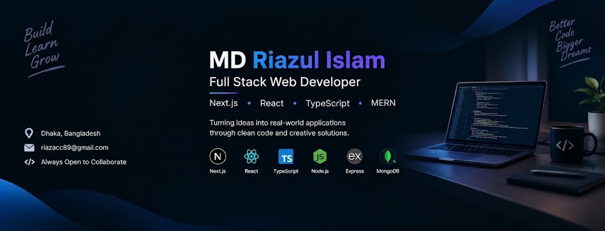

<!-- ===================== HERO ===================== -->

<div align="center">

<p align="center">
  
</p>

</div>

<h3 align="center">
  👋 Welcome to my GitHub profile
</h3>

<p align="center">
  <b>Full Stack Web Developer | Next.js | React | TypeScript</b>
</p>

<p align="center">
  I build modern web applications, explore backend technologies,<br/>
  and continuously learn through real-world projects.
</p>

<p align="center">
  <a href="https://github.com/Riaz-RZ">
    
  </a>
  <a href="https://github.com/Riaz-RZ?tab=repositories">
    
  </a>
</p>

---

# 👨‍💻 About Me

I'm a developer who transitioned from **Accounting to Software Development**.

Currently, I'm focused on building modern web applications using **Next.js, React, TypeScript, and the MERN stack**, while also exploring **Android development with Kotlin**.

I believe the best way to learn programming is by **building real projects, solving problems, and continuously improving**.

```text
### 🚀 Currently

- 🔭 Building projects with Next.js and React
- 🌱 Exploring Next.js and advanced TypeScript
- 💻 Strengthening my MERN full-stack development skills
- 🎨 Building responsive interfaces with Tailwind CSS and DaisyUI
- 📚 Learning through real-world projects and practical development
```

---

# 🛠️ Tech Stack

### 🌐 Frontend

<p>

</p>

### ⚙️ Backend & Database

<p>

</p>

### 📱 Android Development

<p>

</p>

### 🔧 Tools

<p>

</p>

---

---
# 🌐 Connect With Me

<p align="center">

<a href="https://www.linkedin.com/in/riaz-acc89">

</a>
&nbsp;&nbsp;&nbsp;

<a href="mailto:riazacc89@gmail.com">

</a>
&nbsp;&nbsp;&nbsp;

<a href="https://github.com/Riaz-RZ">

</a>

</p>

---

---

# 🚀 Featured Projects

<table>
<tr>

<td width="50%">

### 🏋️ PH-A6-FitLog

A modern workout planning application that helps users explore workouts, build today's plan, and save workouts for later.

**Key Features**

* 🏋️ Workout library
* 📋 Build today's workout plan
* 🔖 Save workouts for later
* ⭐ Workout ratings
* 📊 Workout information and statistics
* 📱 Responsive interface

**Built With**

`Next.js` `TypeScript` `Tailwind CSS` `DaisyUI` `React Icons`

<br/>

<a href="https://ph-a6-fit-log-five.vercel.app">

</a>

<a href="https://github.com/Riaz-RZ/PH-A6-Fitlog">

</a>

</td>

<td width="50%">

### 💻 Dev Stack

A modern technology discovery platform where developers can explore technologies and create their own development stack.

**Key Features**

* 🔎 Technology exploration
* 🗂️ Category filtering
* ⭐ Technology ratings
* 🧰 Build Your Stack
* ➕ Add technologies
* 📱 Responsive interface

**Built With**

`React` `TypeScript` `Tailwind CSS` `Vite`

<br/>

<a href="https://ph-devstack.netlify.app/">

</a>

<a href="https://github.com/Riaz-RZ/PH-Assignments-5-DevStack">

</a>

</td>

</tr>


